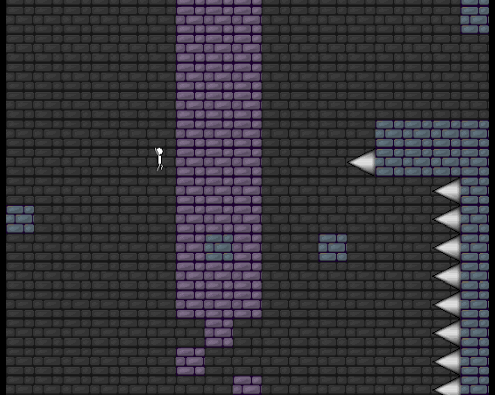

# LemonFrame

A small JavaScript game engine. Please don't waste your time trying to use this, it's old 
and was for personal use only. But it still works after many years! I wouldn't recommend trying to revive this though.

# Try out the demo:

https://making.codes/app/ghub/lframedemo/

# What it does

1. It simplifies the inheritance structure of JavaScript and offers an API to make accessing classes quick
2. It supplies a performant update and render loop with persistent objects
3. It has media helpers
    - Graphics manager
    - Audio manager
    - Animation Class
4. It has input system with easy to use input mappings
5. A "LayerCache" system which improved static background-esque images (greatly improved performance)
6. A data-structure called the "depthManager" which handled drawing elements in what I'd call a truly dirty way

## See the documentation
https://making.codes/app/ghub/lframedemo/documentation.html

# How to test it

While I do not recommend using this library at all, it is still operational after many many years. 
Fortunately there is a demo available and all you need to do is grab this repo and serve the "index.html"
file in the project root.

1. copy project `git clone https://github.com/Im-Andrew/JS-Game-Engine.git`
2. open `index.html` in the project root
3. click the `no` option or `cancel` option or similar
    - This will actually use a hosted json instead of the local one.

## Have VSCODE? 
You can easily view the demo with VSCODE using the extension "live server".

Doing it this way, you can use a localhost version.

1.Install the extension.
    - VS Marketplace Link: https://marketplace.visualstudio.com/items?itemName=ritwickdey.LiveServer
2. Right click on index.html and click 'open with live server'

# LemonFrame's (and a little bit of my game development) History

LemonFrame was literally the first JavaScript project I ever did. No, really, the first
thing I apparently wanted to do when learning JavaScript was "make a game engine". It was
a decent learning experience but is far off from where I am at today. You can tell 
from all of the code that it was built when JavaScript still wasn't quite where it is
today; I believe it's all ECMA5. 

Funnily enough, although this was my first project it did exactly what it was supposed to 
do and was a success in my books. I actually was able to make games with it, and I did, as
you can see a demo exists for it that I actually eventually turned into a barebones "online mmo"
using the famous Socket.io library.

So, my JavaScript experience went in the order of: make an engine -> make a platformer in that engine
-> expand that demo into an MMO. Unfortunately, that MMO is lost; it was proudly hosted on Red Hats
OpenShift when it was actually free, for people like myself, for proably 2 years until it was completely
removed and forgotten. I put a lot of work into that game and have a lot of memories playing it with
friends and, at one point, having an entire class try it out after I brought it up during a
public speaking project in class and everyone pulled out their phones to play it. 

So this ancient relic of my past really did do its job, and somehow performed buttery smooth on those
terrible, terrible, budget android phones. 

If I ever find the source for that LemonFrame based MMO, I would probably transfer it to my new engine!

# There was an editor
If you notice in the levelmap.json, it's a very large file. This was not done by hand it was not made in
any publically available program. I actually had made an editor which was designed around the way the
game works. Notice how it's segmented into a bunch of sections? That's because the editor would show you square sections which made making rooms with transitions a straightforward task to do.

# [Contact me](https://www.making.codes/#contact-me)
I am available for hire. You can quickly get in contact with me here:
[making.codes/#contact-me](https://www.making.codes/#contact-me)
